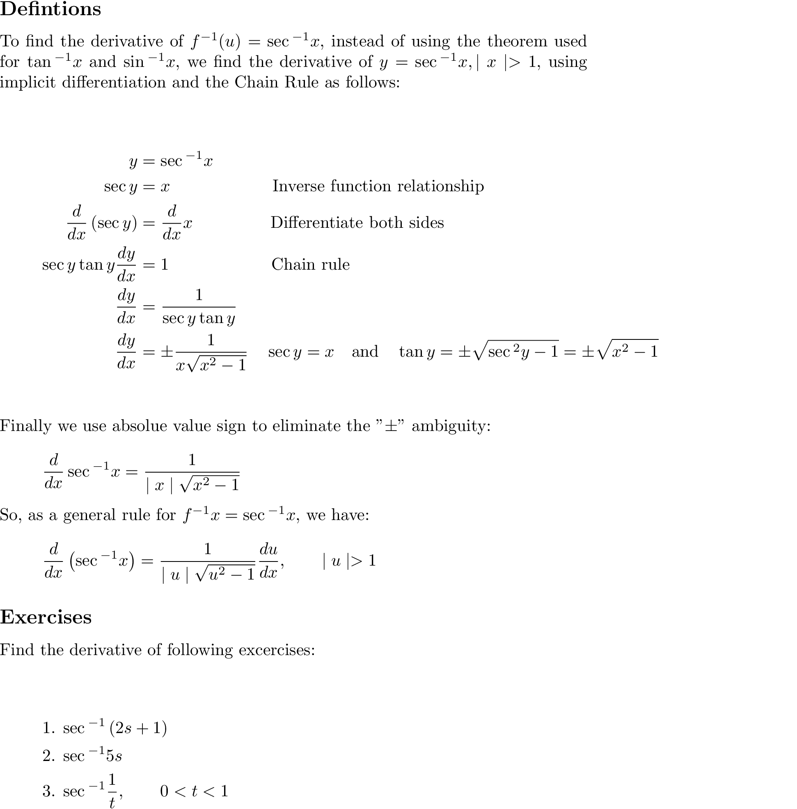

# derivation of arcsec

### Quick Access

#### &#8592; Previous Page

* [03.09.02. derivative of arctan](./../../03.derivatives/09.inverse_trigonometric_functions/02.derivative-of-arctan.md)

#### &#8594; Next Page

* [03.09.04. derivation of other three trigonometric functions](./../../03.derivatives/09.inverse_trigonometric_functions/04.derivatives-of-other-three-functions.md)
