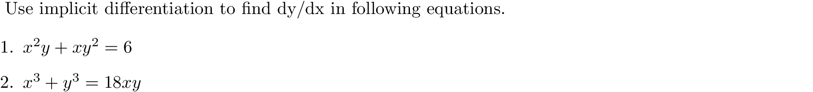

# second direvatives

### Quick Access

#### &#8592; Previous Page

* [03.07.01. differentiating implicitely](./../../03.derivatives/07.implicit_differentiation/01.differentiating-implicitely.md)

#### &#8594; Next Page

* [03.07.03. slopes, tangent and normal line](./../../03.derivatives/07.implicit_differentiation/03.slopes.md)
