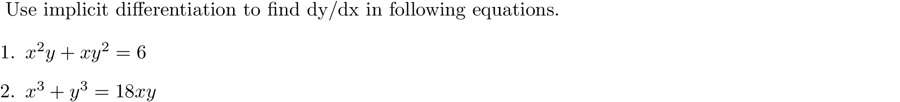

# slopes, tangent and normal line

### Quick Access

#### &#8592; Previous Page

* [03.07.02. second direvatives](./../../03.derivatives/07.implicit_differentiation/02.second-derivatives.md)

#### &#8594; Next Page

* [03.08. derivative of inverse functions and logarithms](./../../03.derivatives/08.inverse_functions_and_logarithms/00.README.md)
