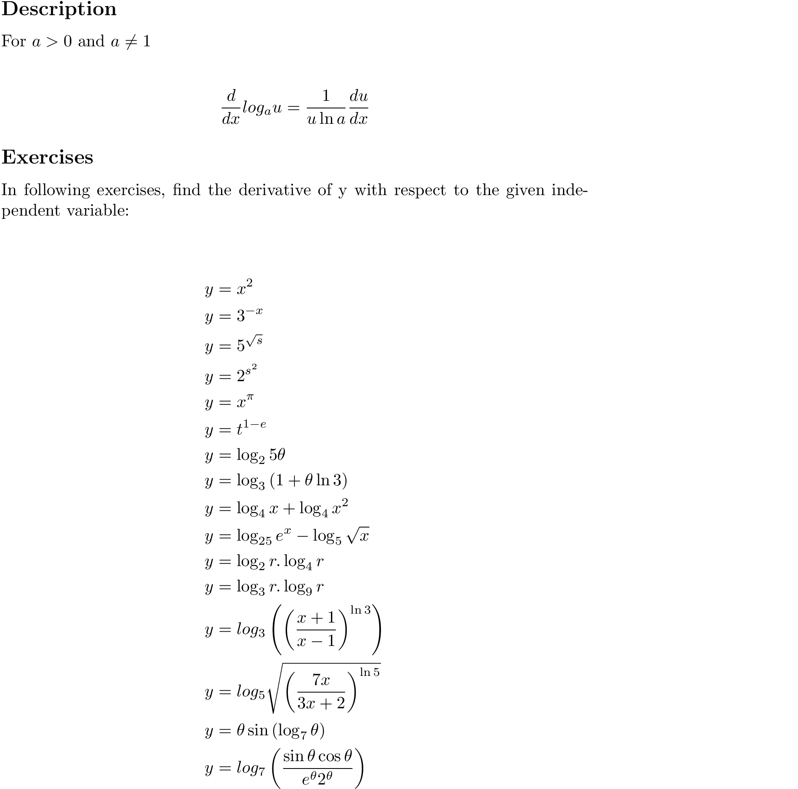

# derivative of logarithms

### Quick Access

#### &#8592; Previous Page

* [03.08.03. derivative of exponential functions](./../../03.derivatives/08.inverse_functions_and_logarithms/03.derivative-of-exponential-functions.md)

#### &#8594; Next Page

* [03.08.05. neper as a limit](./../../03.derivatives/08.inverse_functions_and_logarithms/05.neper-as-limit.md)
