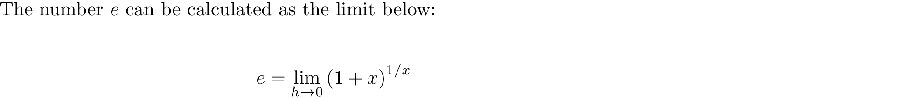

# neper as a limit

### Quick Access

#### &#8592; Previous Page

* [03.08.04. derivative of logarithms](./../../03.derivatives/08.inverse_functions_and_logarithms/04.derivative-of-logarithms.md)

#### &#8594; Next Page

* [03.09. derivative of inverse trigonometric functions](./../../03.derivatives/09.inverse_trigonometric_functions/00.README.md)
