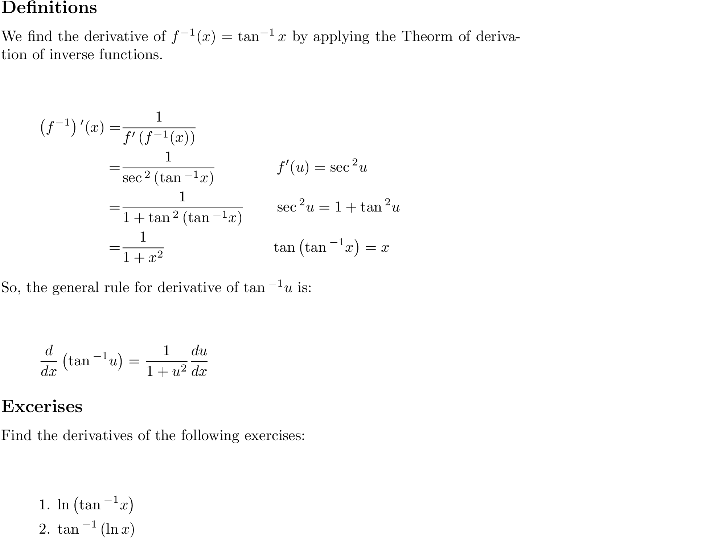

# derivative of arctan

### Quick Access

#### &#8592; Previous Page

* [03.09.01. derivative of arcsin](./../../03.derivatives/09.inverse_trigonometric_functions/01.derivative-of-arcsin.md)

#### &#8594; Next Page

* [03.09.03. derivation of arcsec](./../../03.derivatives/09.inverse_trigonometric_functions/03.derivative-of-arcsec.md)
